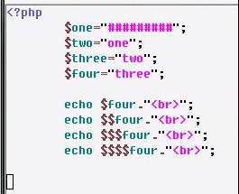
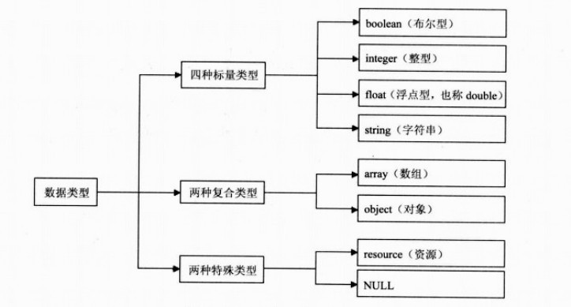
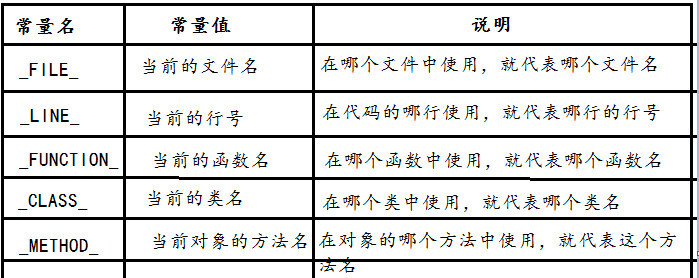

@(CTF)[PHP基础]

[TOC]

下面我们来学习php基础

# PHP基础学习笔记

PHP 是一种创建动态交互性站点的强有力的服务器端脚本语言。使用广泛，并且免费。
# 1. 配置环境
我们这里使用最常用的组合：**Apache－PHP－MySQL**。
Apache是Web服务器，负责回应所有收到的Web请求。比如你访问`http://zhihu.com/1.html`，那么Apache就找到根目录下的1.html文件，将其中的内容返回。如果我需要这个地址能显示动态的东西，比如当前日期时间，那么就写一个PHP程序1.php，当Apache收到`http://zhihu.com/1.php`的请求时，通过CGI调用PHP解释程序，执行1.php文件的内容，然后将返回的字符串返回给客户端。
为了方便，我们使用**XAMPP**,
> XAMPP（Apache+MySQL+PHP+PERL）是一个功能强大的建站集成软件包。这个软件包原来的名字是 LAMPP，但是为了避免误解，最新的几个版本就改名为 XAMPP 了。它可以在Windows、Linux、Solaris、Mac OS X 等多种操作系统下安装使用，支持多语言：英文、简体中文、繁体中文、韩文、俄文、日文等。

XAMPP环境搭建与配置请参考这个：
http://www.jianshu.com/p/de7a5335b787
# 2. PHP常规知识点
## 2.1 php代码块
代码放在`<?php ?>`代码块里面，文件以`.php`结尾
```
<?php
	echo "hello world";
?>
```
## 2.2 声明变量
PHP是类型松散型的语言，不需要类似`C#`,`Java`声明指定的数据类型
```
$num = 100
$str = "zhongxia"
$pid = 3.14
```
*  **变量前一定要使用**`$`
*  不能以数字开头
*  不能使用PHP的运算符号`+-*/%&.`
*  PHP可以使用系统关键字作为变量名
*  PHP变量名称对大小写敏感，（只有变量和常量区分大小写，其他不区分）
*  PHP有三种不同的[变量作用域](http://php.net/manual/zh/language.variables.scope.php)
	*  `local`(局部):函数内部声明的变量拥有`LOCAL`作用域，只能在函数内部进行访问
	*  `global`(全局):在函数之外声明的变量拥有`Global`作用域，只能在函数以外进行访问
		*  `global`关键词用于访问函数内的全局变量
	*  `static`(静态)：静态变量仅在局部函数域中存在，但当程序执行离开此作用域时，其值并不丢失
		*  `static`关键词用于定义静态变量
		*  `static`在首次声明变量时使用
```
<?php    
function myTest() {
   static $x=-1;
   echo $x;
   $x--;
}

myTest();//-1
echo "<br>";
myTest();//-2
echo "<br>";
myTest();//-3
?>
```
* 一个变量的变量名可以动态设置和使用




## 2.3 `PHP`输出文本的基础指令：`echo`和`print`

`echo`和`print`功能一样，输出内容
*  `echo`是`PHP`语句,语句没有返回值
*  `echo`可以输出一行或者多行字符串
*  `print`和`print_r`是函数，函数可以有返回值
*  `print`只能输出一行字符串,只能打印出简单类型变量的值（如`int`，`string`）
	*  `print_r`可以打印出复杂类型的值（如数组，对象）
	*  `var_dump`返回表达式的类型和值，而`print_r`仅返回结果，相比调试代码使用`var_dump`更便于阅读。详情请[参考](http://blog.csdn.net/renzhenhuai/article/details/9317341)

## 2.4 数据类型
**PHP 支持八种原始类型**


* 布尔型
	* `true`or`false`
	* 大小写不敏感
* 整型
	* 可以使用`int`来将小数强制转换成整数
	* `var_dump((int)(26/3));//int(8)`
* 数组
	* 索引数组
	就是下标是顺序整数作为索引，比如第几排第几列。例如：`$class[5]`
	* 关联数组
	就是下标是字符串作为索引（比如名字），例如：`$class2["zhgnsan"]`
	* 多维数组
	包含一个或多个数组的数组
	* 数组单元可以通过`array[key]`语法来访问
	* 这并不意味着总是给键名加上引号。
	用不着给键名为常量或变量的加上引号，否则会使 `PHP`不能解析它们

```
<?php
$array = array(
    "foo" => "bar",
    "bar" => "foo",
);

// 自 PHP 5.4 起
$array = [
    "foo" => "bar",
    "bar" => "foo",
];
?>
```
* 数组运算符

|例子|名称|结果|
| 	:--:	 |	 :--:	 |		:--:	|
|`$a + $b`|	联合 |	`$a` 和 `$b` 的联合,`+`运算符把右边的数组元素附加到左边的数组后面，两个数组中都有的键名，则只用左边数组中的，右边的被忽略。|
|`$a == $b`|	相等|	如果`$a`和`$b`具有相同的键/值对则为`TRUE`|
|`$a === $b`|	全等|	如果`$a`和`$b`具有相同的键／值对并且顺序和类型都相同则为`TRUE`|
|`$a != $b`|	不等|	如果`$a`不等于`$b`则为 `TRUE`
|`$a <> $b`|	不等|	如果`$a`不等于`$b `则为 `TRUE`|
|`$a !== $b`|	不全等|	如果`$a`不全等于`$b `则为 `TRUE`|


## 2.5 运算符
	
```
/ + - * %
==
===
!=
+=
-=

//类成员方法中访问非静态属性
->

//类成员方法中访问静态属性
::

//数组成员访问符号
=>
```
* 并置运算符：`.`
	* PHP唯一的一个字符串运算符
	* 并置运算符`.`用于把两个字符串值连接起来
	* `echo "a= ".$a."<br>";`
	
## 2.6 判断语句
* `if...elseif...else`
* `switch`
* `and`  <==> `&&`
* `or` <==> `||`
```
if($x > 1 && $x < 10){
	//...
}elseif($x>10 && $x < 100){
	//...
}else{
	//...
}

//switch
switch ($x)
{
case 1:
	echo "Number 1";
	break;
case 2:
	echo "Number 2";
	break;
case 3:
	echo "Number 3";
	break;
default:
	echo "No number between 1 and 3";
}
```
## 2.7 循环
`for`,`while`,`do...while`,`foreach` 
```
$i=0;
for($i;$i<10;$i++){
	echo '循环次数'.$i
}
while($i<10){
	echo 'while循环'.$i
	$i++;
}
$arrs = array("red","green","blue","yellow");
//数组在前
foreach($arrs as $value){
	echo "$value <br>";
}
```
## 2.8 定义常量
`PHP`使用`define`来定义常量
一个常量一旦被定义，就不能再改变或者取消定义。
```
//第一个参数就是常量的名称
define("GREETING","Welcome to W3School.com!");
echo GREETING;

//PHP只有常量和变量区分大小写
//要定义不区分大小写的常量，需要define第三个参数为true
define("GREETING","Welcome to W3School.com!",true);
echo greeting;
```
常用魔术常量:



## 2.9 函数
```
//函数的定义，设置参数，默认参数
function say($name,$age=18){
	echo 'this is a function! $name';
}
```
## 2.10 超全局变量
超全局变量就是PHP内置的一些全局变量，不需要自己定义。使用它们也不需要引入任何东西，直接使用就行
```
$GLOBALS
$_SERVER
$_REQUEST
$_POST
$_GET
$_FILES
$_ENV
$_COOKIE
$_SESSION
```
# 3. 参考资料
1. http://www.w3school.com.cn/php/index.asp
1. http://php.net/manual/zh/langref.php
1. http://www.itzhainan.com/archives/50
1. https://github.com/zhongxia245/blog/issues/54
1. https://segmentfault.com/a/1190000000661646
1. https://www.zhihu.com/question/19896544/answer/13284800
1. http://blog.csdn.net/renzhenhuai/article/details/93173


# 4. 作业
## 1. 设计并实现一个小型留言系统，要求具有一下功能：
* 登陆模块、注册模块
* 添加发言模块，评论模块，类似于`github`的`issue`	
* 权限划分，至少得有管理员和普通用户区别
	* 管理员对所有的发言和评论具有修改、删除权限
	* 普通用户只有修改、删除自己的发言、自己的评论权限
* 用户能上传照片作为自己的图像
	
**未说明部分自行处理**

结果提交: 

**系统说明文件（markdown）＋源代码（源代码需要添加注释)＋数据库sql文件（包括数据库结构和数据）**

## 2. 提交学习笔记
* 我这里放出来的笔记内容很少，请不要照搬，要自己找资料扩充
* 在打基础的过程中，最好每行代码都手工敲一遍!
* git会记录你的每次提交，任何人都可以看见，大家共同见证成长，不要怕犯错，什么时候都可以改进得更好
* 把目录按要求整整吧，`git`和`markdown`基本操作该熟练掌握了
