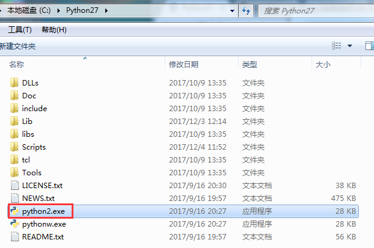
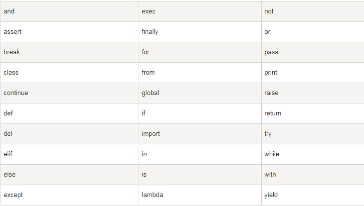
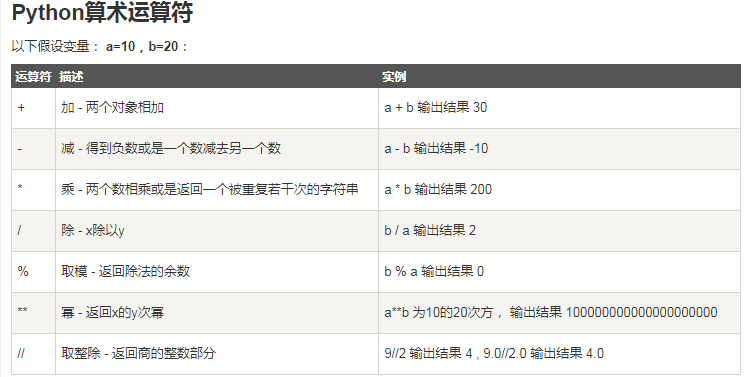
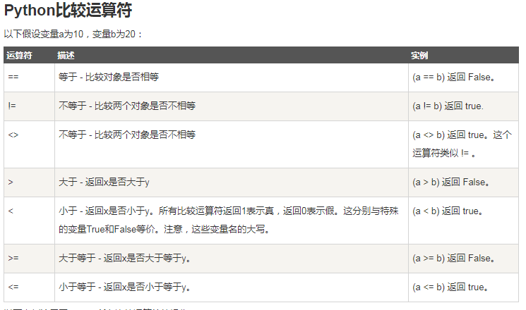
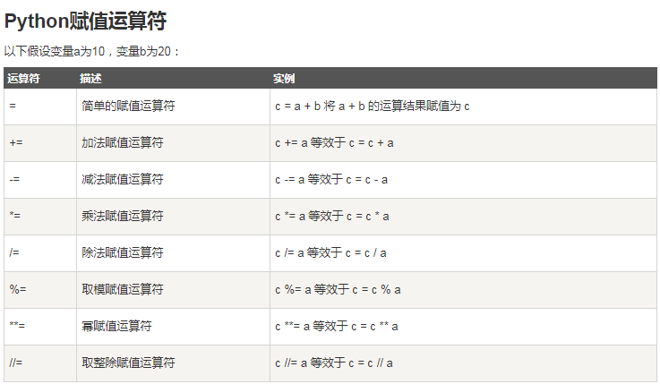
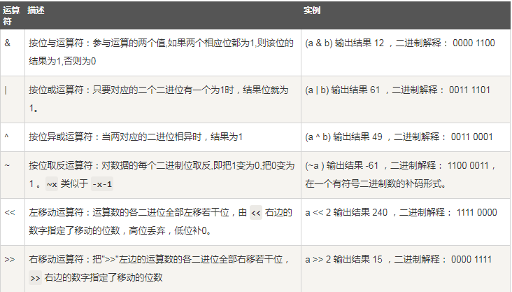

@(CTF)[Python基础]

[TOC]

下面我们来学习python基础
# python学习笔记

* Python是著名的“龟叔”Guido van Rossum在1989年圣诞节期间，为了打发无聊的圣诞节而编写的一个编程语言。
* 龟叔给Python的定位是**优雅**、**明确**、**简单**，所以Python程序看上去总是简单易懂，初学者学Python，不但入门容易，而且将来深入下去，可以编写那些非常非常复杂的程序。
* Python就为我们提供了非常完善的基础代码库，覆盖了网络、文件、GUI、数据库、文本等大量内容，被形象地称作“**内置电池**（batteries included）”。用Python开发，许多功能不必从零编写，直接使用现成的即可。
* Python是跨平台的，它可以运行在Windows、Mac和各种Linux/Unix系统上。在Windows上写Python程序，放到Linux上也是能够运行的。
* CTF学习中经常需要一门语言快速实现自己的某个想法，python是个好帮手
# 1. 配置环境

现在使用最多的是python2.7，但是使用python3也越来越多，建议使用python3，这里我们使用python3，安装指导[见这里](https://www.liaoxuefeng.com/wiki/0014316089557264a6b348958f449949df42a6d3a2e542c000/0014316090478912dab2a3a9e8f4ed49d28854b292f85bb000)
大家可以自行学习[python2.7](https://www.liaoxuefeng.com/wiki/001374738125095c955c1e6d8bb493182103fac9270762a000)，使用python2.7或者python3完成后续任务都可以。

### 电脑安装多个版本的python
如果只装一个版本可以跳过此步骤
* 首先按照教程[安装python2.7](https://www.liaoxuefeng.com/wiki/001374738125095c955c1e6d8bb493182103fac9270762a000/001374738150500472fd5785c194ebea336061163a8a974000)
 
 

* 然后[安装python3.6](https://www.liaoxuefeng.com/wiki/0014316089557264a6b348958f449949df42a6d3a2e542c000/0014316090478912dab2a3a9e8f4ed49d28854b292f85bb000)


* 使用方法1 -- `py.exe`
Python社区就给出了官方解决方案,我们在安装Python3（>=3.3）时，Python的安装包实际上在系统中安装了一个启动器py.exe，默认放置在文件夹C:\Windows\下面。这个启动器允许我们指定使用Python2还是Python3来运行代码（当然前提是你已经成功安装了Python2和Python3）。[参考](https://www.zhihu.com/question/21653286)
```
C:\Users\Administrator>py -2 -V
Python 2.7.14

C:\Users\Administrator>py -2 -m pip -V
pip 9.0.1 from C:\Python27\lib\site-packages (python 2.7)

C:\Users\Administrator>py -3 -V
Python 3.6.3

C:\Users\Administrator>py -3 -m pip -V
pip 9.0.1 from C:\Python36\lib\site-packages (python 3.6)
```
* 使用方法二
以`Python2.7`为例，在`Python2.7`目录下，直接将`python.exe`重命名为`python2.exe`



```
C:\Users\Administrator>python2 -V
Python 2.7.14

C:\Users\Administrator>python2 -m pip -V
pip 9.0.1 from C:\Python27\lib\site-packages (python 2.7)
```
python3同理

# 2. python3常规知识点
## 2.1 运行方式
* 交互模式
在Python交互式模式下，可以直接输入代码，然后执行，并立刻得到结果。
```
C:\Users\Administrator>python2
Python 2.7.14 (v2.7.14:84471935ed, Sep 16 2017, 20:25:58) [MSC v.1500 64 bit (AM
D64)] on win32
Type "help", "copyright", "credits" or "license" for more information.
>>> print "hello world"
hello world
```
* 命令行模式
在命令行模式下，可以直接运行`.py`文件。
```
C:\Users\Administrator>echo "print 'hello world'" > hello.py

C:\Users\Administrator>type hello.py
"print 'hello world'"

C:\Users\Administrator>echo print 'hello world' > hello.py

C:\Users\Administrator>type hello.py
print 'hello world'

C:\Users\Administrator>python hello.py
  File "hello.py", line 1
    print 'hello world'
                      ^
SyntaxError: Missing parentheses in call to 'print'. Did you mean print('hello w
orld')?

C:\Users\Administrator>python2 hello.py
hello world
```
* 在命令行模式直接运行python代码
```
C:\Users\Administrator>python -c "print('hello world!')"
hello world!
```
## 2.2 python基础语法
### 标识符（变量名）
* 在 Python 里，变量名由字母、数字、下划线组成，但不能以数字开头
* Python 中的变量名是区分大小写的
* 以单下划线开头`_foo`的代表不能直接访问的类属性，需通过类提供的接口进行访问，不能用`from xxx import *`而导入；
* 以双下划线开头的 `__foo` 代表类的私有成员；
* 以双下划线开头和结尾的 `__foo__` 代表 Python 里特殊方法专用的标识，如 `__init__()` 代表类的构造函数。
* Python 可以同一行显示多条语句用分号`;`
### 保留字
* 所有 Python 的关键字只包含小写字母
* 这些保留字不能用作常数或变数，或任何其他标识符名称
* `pass`是空语句，是为了保持程序结构的完整性。



### 行与缩进
* python 最具特色的就是用缩进来写模块
* 缩进的空白数量是可变的，但是所有代码块语句必须包含相同的缩进空白数量，这个必须严格执行
### 多行语句
* 斜杠` \`将一行的语句分为多行显示
* 语句中包含 `[]`, `{}` 或 `()` 括号就不需要使用多行连接符
### Python 引号
* Python 可以使用引号(`' `)、双引号(`"` )、三引号(`'''`或`"""`) 来表示字符串，引号的开始与结束必须的相同类型的
* 三引号可以由多行组成，编写多行文本的快捷语法，常用于文档字符串，在文件的特定地点，被当做注释
### Python注释
* python中单行注释采用`#`开头
* python 中多行注释使用三个单引号(`'''`)或三个双引号(`"""`)
### 输出
* print
```python3
#python3
>>> print('hello world')
hello world

#python2
>>> print "hello world"
hello world
```
### 输入
* input
* sys.stdin.readline
```python3
>>> s=input('hello')
helloJack
>>> s
'Jack'

>>> import sys
>>> s=sys.stdin.readline()
Jack
>>> s
'Jack\n'
```

### 一个完整的例子
```python3
#!/usr/bin/env python
#coding=utf8

import sys

print(sys.argv)

'''
脚本语言的第一行，目的就是指出，你想要你的这个文件中的代码用什么可执行程序去运行它，就这么简单。
#!/usr/bin/python : 是告诉操作系统执行这个脚本的时候，调用 /usr/bin 下的 python 解释器；
#!/usr/bin/env python(推荐）: 这种用法是为了防止操作系统用户没有将 python 装在默认的 /usr/bin 路径里。当系统看到这一行的时候，首先会到 env 设置里查找 python 的安装路径，再调用对应路径下的解释器程序完成操作。
#!/usr/bin/python 相当于写死了python路径;
#!/usr/bin/env python 会去环境设置寻找 python 目录,推荐这种写法
'''
```
* 运行
```python3
x:\ctf_web\test>test.py
['x:\\ctf_web\\test\\test.py']
```
## 2.3 变量

* python是一个**动态语言**
```python3
>>> a='ABC'
```
Python解释器干了两件事情：

* 在内存中创建了一个'ABC'的字符串；

* 在内存中创建了一个名为a的变量，并把它指向'ABC'。
```python3
>>> a='ABC'
>>> a
'ABC'
>>> type(a)
<type 'str'>
>>> b=5
>>> a=b
>>> a
5
>>> type(a)
<type 'int'>
```

## 2.4 数据类型
* 使用`type()`查询数据类型
* 使用`id()`查询身份标识
* python基本数据类型

|type|类型|备注|
|:--:|:--:|:--:|
|int|整数|没有大小限制|
|float|浮点数|没有大小限制，但是超出一定范围就直接表示为 inf(无限大)|
|str|字符串|
|bool|布尔值|(True|False)|
|None|空值|

* python内置数据类型

|type|类型|备注|
|:--:|:--:|:--:|
|list|列表|有序集合；索引从0开始，-1表示最后一个元素,超出会越界|
|tuple|元组|有序列表；一旦初始化就不能更改|
|dict|字典|类比于其他语言中的map，使用键-值(key-value)存储|
|set|集合|set中没有重复的元素|

* Python程序是**大小写敏感**的，如果写错了大小写，程序会报错
* 以`#`开头的语句是注释，解释器会忽略掉注释，写好注释有利于比人理解你的思路
* 其他每一行都是一个语句，当语句以冒号`:`结尾时，缩进的语句视为代码块。

## 2.5 运算符
* Python算术运算符



* Python比较运算符



* Python赋值运算符



* Python位运算符



* Python逻辑运算符


## 2.6 判断语句
* `if`
```python3
if 判断条件1:
    执行语句1……
elif 判断条件2:
    执行语句2……
elif 判断条件3:
    执行语句3……
else:
    执行语句4……
```
* `while`循环
```python3
while 判断条件：
    执行语句……
```
* `for`循环
```python3
for iterating_var in sequence:
   statements(s)
```
* `else`
在 python 中，for … else 表示这样的意思，for 中的语句和普通的没有区别，else 中的语句会在循环正常执行完（即 for 不是通过 break 跳出而中断的）的情况下执行，while … else 也是一样。
```
#!/usr/bin/python
# -*- coding: UTF-8 -*-
 
for num in range(10,20):  # 迭代 10 到 20 之间的数字
   for i in range(2,num): # 根据因子迭代
      if num%i == 0:      # 确定第一个因子
         j=num/i          # 计算第二个因子
         print '%d 等于 %d * %d' % (num,i,j)
         break            # 跳出当前循环
   else:                  # 循环的 else 部分
      print num, '是一个质数'
```


* 循环控制语句


## 2.7 函数
* 函数语法
```
def functionname( parameters ):
   "函数_文档字符串"
   function_suite
   return [expression]
```
* 函数参数类型
	* **位置参数**
        * **必选参数**   
        def power(x)
        * **默认参数**  
        def power(x=2)
    * **可变参数**
    def power(x) x为一个list或者tuple
    * **关键字参数** 
    def power(**kw)
    * **命名关键字参数***
    def power(name,age,*,city,job) *后面的参数视为命名关键字参数
    def power(name,aget,*args,city='Beijing',job)
# 3. Requests库
requests是python的一个HTTP客户端库，跟urllib，urllib2类似，但是requests更加简单。
## 3.1 官方文档
http://cn.python-requests.org/zh_CN/latest/

## 3.2 基本`Get`请求
```python3
#!/usr/bin/env python
#coding=utf8
import requests
url = 'http://www.baidu.com'
r=requests.get(url)

#请求方法
print(r.request.method)
#请求头
print(r.request.headers)
#请求体
print(r.request.body)
#请求url
print(r.url)

#返回内容编码
print(r.encoding)
#状态行
print(r.status_code)
#响应头
print(r.headers)
#响应体
###获得二进制响应内容
print(r.content)
####返回解码成unicode的内容
print(r.text)

```
## 3.3 基本`Post`请求
```
#-*- coding:utf-8 -*-
import requests
url = 'http://www.baidu.com'
payload = {'key1': 'value1', 'key2': 'value2'}
r = requests.get(url, params=payload)
print r.text
```
## 3.4 session
会话对象让你能够跨请求保持某些参数。它也会在同一个 Session 实例发出的所有请求之间保持 cookie， 期间使用 urllib3 的 connection pooling 功能。所以如果你向同一主机发送多个请求，底层的 TCP 连接将会被重用，从而带来显著的性能提升。
```
#-*- coding:utf-8 -*-
import requests
s = requests.Session()
url1 = 'http://www.exanple.com/login'#登陆地址
url2 = "http://www.example.com/main"#需要登陆才能访问的页面地址
data={"user":"user","password":"pass"}
headers = { "Accept":"text/html,application/xhtml+xml,application/xml;",
            "Accept-Encoding":"gzip",
            "Accept-Language":"zh-CN,zh;q=0.8",
            "Referer":"http://www.example.com/",
            "User-Agent":"Mozilla/5.0 (Windows NT 6.1; WOW64) AppleWebKit/537.36 (KHTML, like Gecko) Chrome/42.0.2311.90 Safari/537.36"
            }
res1 = s.post(url1, data=data，headers=headers)
res2 = s.post(url2，headers=headers)
print(resp2.content)
```
# 4. 相关资料
以上关于python的学习笔记是最浅显的，要真正掌握它需要大家利用业余的时间持续练习。
给出相关学习链接如下：
[合天-Python编程基础（上）](http://www.hetianlab.com/expc.do?ec=ECID172.19.104.182015082708595900001)

[合天-Python编程基础（下）](http://www.hetianlab.com/expc.do?ec=ECID172.19.104.182015082709123800001)

[廖雪峰Python3](https://www.liaoxuefeng.com/wiki/0014316089557264a6b348958f449949df42a6d3a2e542c000)

[python学习笔记](http://docs.linuxtone.org/ebooks/Python/python%E5%AD%A6%E4%B9%A0%E7%AC%94%E8%AE%B0.pdf)

[中文Python笔记](https://github.com/lijin-THU/notes-python)

## python进阶
[Python 学习笔记 第二版.pdf](https://github.com/qyuhen/book/blob/master/Python%20%E5%AD%A6%E4%B9%A0%E7%AC%94%E8%AE%B0%20%E7%AC%AC%E4%BA%8C%E7%89%88.pdf)

http://www.jianshu.com/p/e1f8b690b951

https://morvanzhou.github.io/tutorials/python-basic/

http://www.runoob.com/python/python-basic-syntax.html

https://www.cnblogs.com/jasmine-Jobs/p/7045016.html

# 5. 作业
## 1. 使用python完成ctf题目-[实验吧-天下武功为快不破](http://www.shiyanbar.com/ctf/1854)
提交writeup，越详细越好

题目路径：
`首页>决斗场>训练题库>CTF题库>天下武功唯快不破`

## 2. 提交学习笔记
在版本库中所在组内创建以自己github账号名字命名的文件夹，然后把作业放在自己文件夹内，作业文件名称让人能看懂就行，通过PR提交
